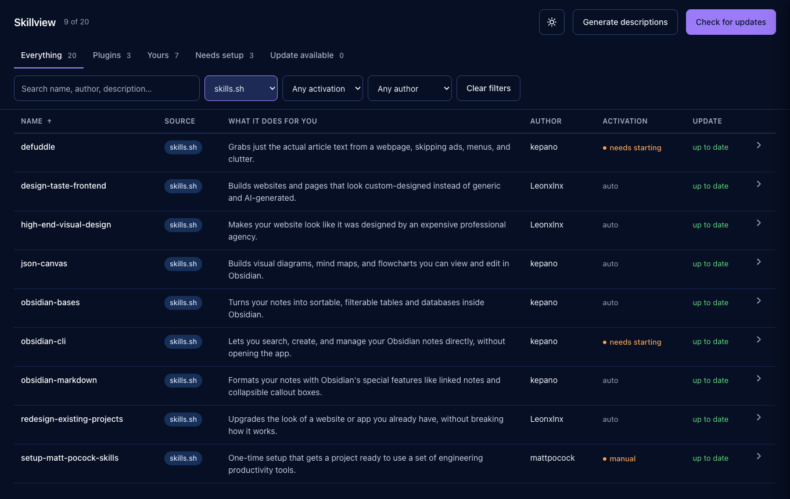

# Skillview

**One table for every Claude Code skill, plugin and MCP server you've installed — whatever installed it.**

What each one actually does, how to invoke it, and whether it's fallen behind upstream. Runs locally, has no dependencies, and only reads unless you tell it otherwise.



## The problem

Your agent's capability arrives through mechanisms that don't know about each other — plugin marketplaces, `skills.sh`, package managers, MCP config, and the skills you wrote yourself. Each has its own storage location, its own metadata format, and its own update command.

Nothing shows them together. So things get installed, forgotten, and then sit unused during the exact task they were installed for. That's the cost this fixes — not disk space.

## What you get

- **Everything in one table** — four install mechanisms, one list, no terminal.
- **Plain English, not keyword soup.** A `SKILL.md` description exists to make a model trigger the skill. Skillview rewrites it into what the thing does *for you*.
- **How to actually use it.** Every sub-command a plugin ships — bundled skills, slash commands, agents, hooks, MCP servers — listed as numbered one-liners.
- **What's gone stale**, across every mechanism, in one refresh. One network call per source repo.
- **What you didn't install.** A pack ships 13 skills and you took 3? It shows the other 10.
- **Who wrote it** — derived from whether an upstream exists, so your own skills are correctly marked as yours to maintain.
- **Can I use this right now?** Fires automatically, needs a slash command, or needs something started first — with the exact command.

Zero dependencies. Python 3.8+ and the standard library. Binds to `127.0.0.1`.

## Run it

```bash
python3 app.py
```

Then open <http://localhost:8477>.

No dependencies, no virtualenv, no build step — Python 3.8+ and the standard library. It binds to `127.0.0.1` only.

### Optional: plain-English descriptions

The table works immediately without this. To get descriptions that say what each tool does *for you* — rather than the keyword-stuffed blurb that exists to make a model trigger the skill — you need the `claude` CLI installed **and signed in**:

```bash
claude
```

Run that once in a terminal and complete the login prompt. Then click **Generate descriptions** in the dashboard.

This is genuinely optional. If the CLI is missing or not signed in, the dashboard says so and falls back to raw descriptions — nothing breaks. There's no API key to configure and no account to create beyond the Claude one you already have.

## What it shows

| Column | What it tells you |
|---|---|
| **Mechanism** | marketplace · skills.sh · local · unknown |
| **What it does for you** | plain-English, not the model-facing frontmatter blurb |
| **Author** | who wrote it — derived from whether an upstream source exists, never from a configured name |
| **Surface** | which agents actually have it installed |
| **Activation** | *auto* (fires itself) · *manual* (you type the command) · *needs starting* (something must be installed or running first) |
| **Update** | up to date · update available · no upstream · unknown |

Click **View** on any row for the full picture: every sub-command as a numbered one-liner, prerequisites with their exact commands, install path, source, and the command that updates it.

For plugins, "sub-commands" means everything the plugin ships — bundled skills, slash commands, agents, hooks, and MCP servers. A plugin carrying six skills shows six, not zero.

## The two buttons

**Check for updates** — one network call per distinct source repo, so a full pass is a few requests regardless of how many skills you have. `skills.sh` installs compare the recorded folder hash against the upstream git subtree SHA, which is exact. Marketplace plugins compare declared version to installed version.

**Generate descriptions** — shells out to the `claude` CLI already on your machine (no API key, no setup) and writes one plain sentence per tool into `descriptions.json`. That file is plain JSON: edit any line by hand and your version is kept. If the CLI isn't installed or isn't logged in, the table falls back to raw descriptions and says so.

## Running updates — off by default

Out of the box Skillview only reads. It shows you the update command and you run it yourself. To let it run updates for you:

```bash
python3 app.py --enable-updates
```

Or set `"updates": true` in `config.json`, or `SKILLVIEW_ENABLE_UPDATES=1`.

**Why it's opt-in.** Everything else here only reads files and makes GET requests. Running updates means a local web server executing shell commands, which is a categorically different thing to leave running. Off by default means a clone you're merely looking at has no write surface at all — the endpoint refuses, and the button never appears.

All of that lives in one file, [`updater.py`](updater.py), so you can audit the entire write surface in a couple of minutes. What it guarantees, and what [`test_updater.py`](test_updater.py) asserts:

- **No shell, ever.** Every command is an argv list run with `shell=False`, so quoting, globbing, pipes and `;` have no meaning.
- **The page cannot supply a command.** A request names an item; that name is looked up in the live inventory and the *row's own* values build the argv. A name matching no row is refused before anything runs.
- **Only known mechanisms have commands.** Anything else is refused with the manual instruction rather than guessed at.
- **One at a time**, under a lock, with a timeout.

Plugin updates change files on disk but the running Claude Code session keeps the old copy, so those report **restart required** rather than claiming success.

## What it deliberately doesn't do

It doesn't track usage, manage dependencies, or edit skills. It reads, reports, and — if you ask it to — runs the ecosystem's own update command.

## Honest limits

- Availability in the claude.ai **chat window** is server-side and leaves no local trace, so it isn't claimed. The Surface column reports only what's on disk.
- **Activation** for "needs starting" is detected by pattern-matching install hints in a skill's own docs. It catches the common shapes and will miss unusual phrasing.
- Install sources it doesn't recognise are marked *update manually* rather than guessed at. It never claims "up to date" without evidence.
- Developed and run on macOS. Linux is statically audited but not yet executed there: paths are `$HOME`-relative via `pathlib` throughout, every file read/write declares `encoding="utf-8"` explicitly (Python 3.7+ auto-coerces away from an ASCII-only locale on POSIX regardless, so this is belt-and-suspenders rather than a fix for a reproduced failure), and `run-ui.command`'s auto-open falls back to printing the URL when neither `open` nor `xdg-open` exists. If something real turns up on an actual Linux box, please file it. Windows is untested and unsupported.

## Where it reads from

Nothing is hardcoded to a user or a path. Locations come from `$HOME` and `CLAUDE_CONFIG_DIR`.

```
~/.claude/plugins/installed_plugins.json   marketplace plugins
~/.claude/plugins/known_marketplaces.json  their source repos
~/.agents/.skill-lock.json                 skills.sh installs
~/.claude/skills/<name>/SKILL.md           everything else
```

Any of these being absent is normal — each is read independently, and a machine with none of them shows an empty table rather than an error.

## Layout

```
app.py            HTTP shim — routes to pure functions, nothing else
inventory.py      filesystem: read every mechanism into one row shape
upstream.py       network: update status per source repo
describe.py       subprocess: claude CLI → cached descriptions
updater.py        the only code that can change anything. Off by default
ui.html           the whole frontend, vanilla, no CDN
test_inventory.py python3 test_inventory.py
test_updater.py   python3 test_updater.py
```

`app.py` is intentionally thin so the web layer stays replaceable.

## Tests

```bash
python3 test_inventory.py && python3 test_updater.py
```

`test_updater.py` runs against a stubbed subprocess: it asserts what the updater *asked* to run, so the safety properties are checked without anything executing. `python3 updater.py` prints the exact command it would run for every installed item, and runs nothing.

Fixture-driven, no framework. Covers the empty machine, each mechanism in isolation, an unrecognised installer, and a `SKILL.md` whose frontmatter real YAML parsers reject — that last one exists in the wild and takes down other tools.

## Licence

MIT.
